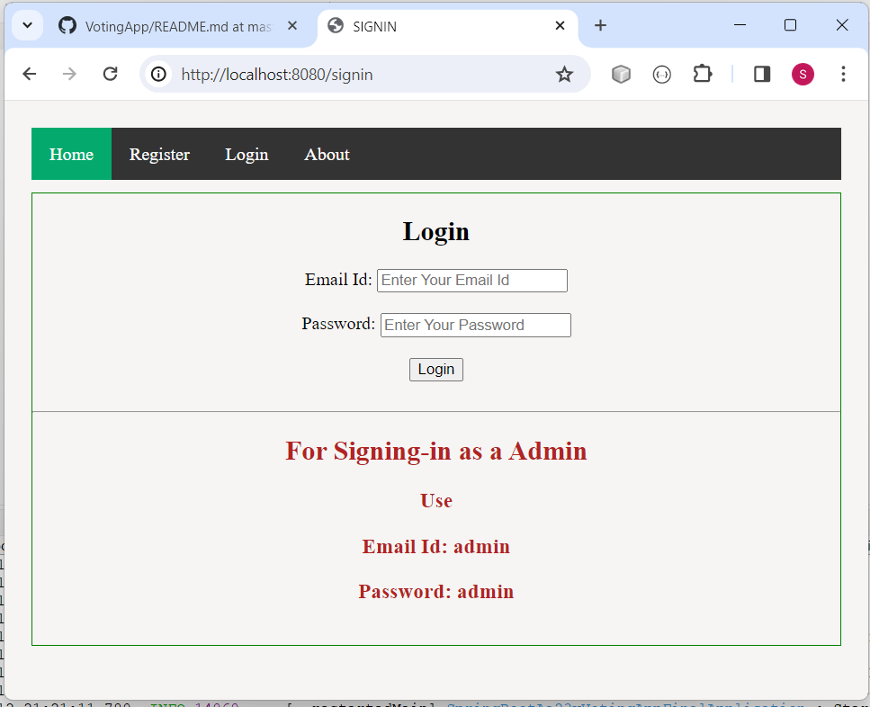
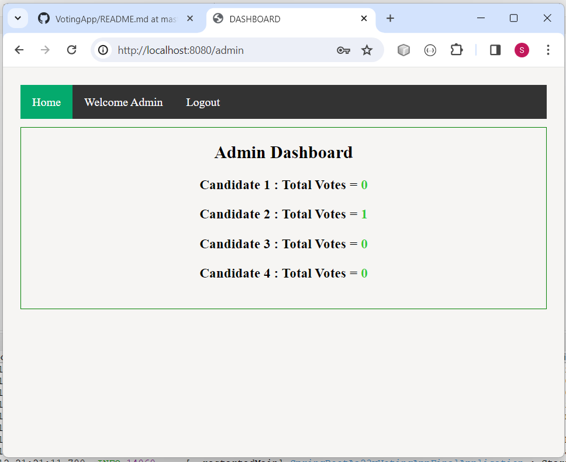
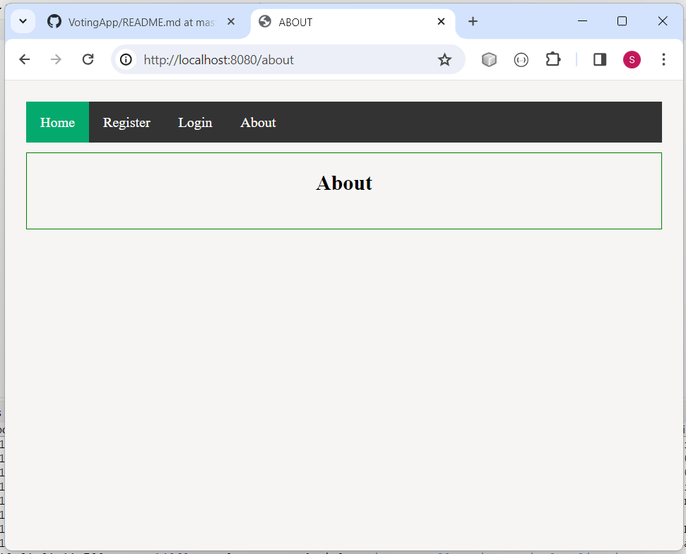

# Voting Application - Java J2EE

### Take a look at this Application
url: https://swapnilbamble1438.github.io/VotingApplication/

### It is Java J2EE Application. Build in Eclipse IDE using Maven.

### Application Features:
- User can vote the Candidate.
- Admin has the permission to see the vote details.

### Technology used in this Project: 
- i) Java: all Backend logic has been written in java.
- ii) HTML,CSS and Bootstrap: designing page layout.
- iii) JSP & Javascript: all the front end logic has been written in jsp and javascript. 
- iv) MySQL: MySQL database has been used as database. 
- v) Tomcat: project will be run over the tomcat server.
- vi) Maven: Maven is used for getting required jar files.

### Software And Tools Required:
- Java JDK 8+
- Eclipse EE
- Apache Maven
- Tomcat v8.0+
- MySQL

### Steps To Import And Run The Project in Eclipse EE
- In Eclipse
- Click on File
- Select Import
- Select Projects from Git(with smart import) -> Next
- Select Clone URI -> Next
- In URI paste this url: https://github.com/swapnilbamble1438/VotingAppJ2EE.git
  -> Next
-  Now in Local Destination

-  proceed -> Next

- select -> Search for nested projects
- and select -> Detect and configure project natures options

            Now only select VotingAppJ2EE\B7iii_VotingApp_MavenProject_Final
            -> Finish
  
-  If everything goes right Project will get successfully imported
-  Now wait for few seconds for getting things properly loaded

  ### Put this MySQL Queries for creating Database and Tables

          create database votingappj2ee;
          
          create table Candidate(
          id int not null,
          candidate varchar(255),
          votes int,
          Primary key(id));
          
          insert into Candidate(id,candidate,votes) values(1,"candidate1",0);
          
          insert into Candidate(id,candidate,votes) values(2,"candidate2",0);
          
          insert into Candidate(id,candidate,votes) values(3,"candidate3",0);
          
          insert into Candidate(id,candidate,votes) values(4,"candidate4",0);

          create table User(
          id int not null auto_increment,
          email varchar(255),
          name varchar(255),
          password varchar(255),
          phone int,
          status varchar(255),
          role varchar(255),
          Primary key(id));
          
          insert into User (email,name,password,phone,status,role)
          values("admin","admin","admin",
          1234,"I am Admin User","ROLE_ADMIN");

-  Right Click On Project > Run As > Run On Server > Select Tomcat V8.0+ > Next > Finish
-  Now Website will get open, if not, then try opening it manually in Browser,
   Type Url: http://localhost:8082/B7iii_VotingApp_MavenProject_Final
-  Note: In Url put Port according to your server.
  

### Some Screenshots of this Project:

==================================================================================================================================================================

==================================================================================================================================================================

==================================================================================================================================================================

==================================================================================================================================================================

==================================================================================================================================================================

==================================================================================================================================================================

==================================================================================================================================================================

==================================================================================================================================================================

==================================================================================================================================================================

   

### Project Creator: Swapnil Bamble

